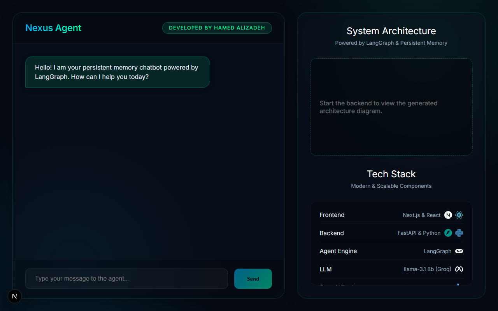

# Nexus Agent 🦜⚡

A modern, stateful AI chatbot built with **LangGraph**, featuring a **FastAPI** backend and a sleek, glassmorphism-styled **Next.js** frontend. This project demonstrates advanced agentic workflows, including persistent memory and automatic internet search execution, wrapped in a highly polished, portfolio-ready UI.

Developed by **Hamed Alizadeh**.




---

## 🚀 Key Features

- **Persistent Memory:** Complete conversation history is cached per user thread inside a local SQLite database (`checkpoint.sqlite`), ensuring the LLM never loses context, even if the browser tab is completely refreshed!
- **Autonomous Tool Usage:** The agent dynamically infers when it needs real-time information to answer complex queries and seamlessly triggers the **Tavily Search API**.
- **Visual Event Indicators:** The Next.js interface carefully monitors LangGraph's intermediate message states natively. When an LLM triggers an external search tool, a sleek UI badge (🌐 *Used Internet Search*) attaches to the generated chat bubble.


## 🛠️ Technology Stack

| Layer          | Technologies |
| -------------- | ------------ |
| **Frontend**   | ⚛️ Next.js & React (Vanilla CSS, Dark Mode) |
| **Backend**    | ⚡ FastAPI & Python |
| **Agent Engine**| 🦜 LangGraph |
| **LLM Engine** | 🦙 Llama 3.1 8b (Accelerated via Groq) |
| **Web Search** | 🔍 Tavily Search API |

*(Note: The backend is highly modular and easily configurable to support Google Gemini or OpenAI LLMs by adjusting the imports within `app.py`).*

---

## 🏗️ Getting Started

### 1. Requirements
Ensure you have the following installed on your machine:
- Node.js (v18+)
- Python 3.10+
- `uv` (Recommended Python package manager for hyper-fast environment creation)

### 2. Environment Variables
Create a `.env` file in the root directory and provide your API keys:
```env
TAVILY_API_KEY="your_tavily_api_key_here"
GROQ_API_KEY="your_groq_api_key_here"
```

### 3. Backend Setup
Navigate to the root directory and install your Python dependencies:
```bash
uv pip install fastapi uvicorn langgraph langchain-groq langchain-tavily python-dotenv
```
Boot up the Python backend server:
```bash
uv run uvicorn api:api --reload
```
*The backend will safely bind to `localhost:8000` and automatically build its local `checkpoint.sqlite` database context!*

### 4. Frontend Setup
In a new terminal window / session, step into the `/frontend` directory:
```bash
cd frontend
npm install
npm run dev
```
Open up your browser and navigate to [http://localhost:3000](http://localhost:3000).

---

## 📜 System Architecture Pipeline
At a high level, the flow operates as follows:
1. `ChatRequest` (Next.js) lands at the FastAPI `/chat` endpoint.
2. The `SqliteSaver` identifies the active `thread_id` and securely loads prior memory context.
3. LangGraph spins up a conditional state graph block to deduce whether the chat agent needs to consult the `internet_search` tool node.
4. Fully structured responses (flattening multidimensional LangChain blocks into clean Strings) and state indicators (`used_tool`) are passed back natively to the React application.
